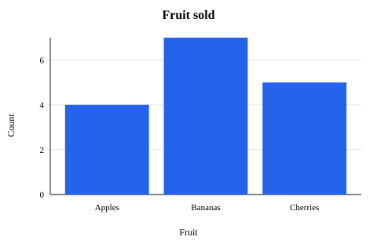

# Polyglot Embedding Demo with GraalVM: Quarkus

Demonstration project showing how to embed GraalJS in a Quarkus REST service with the GraalVM Polyglot API and Maven.
It exposes a `POST /chart` endpoint that validates JSON chart data and uses bundled, trusted JavaScript to generate an SVG bar chart.

For more details on polyglot embedding, see the GraalVM documentation:
https://www.graalvm.org/latest/reference-manual/embed-languages/

## Setup

Use a GraalVM distribution that is compatible with the GraalVM Polyglot version configured in [pom.xml](./pom.xml). By default, this example uses Polyglot version `25.1.3`.

For the best guest-language performance, run the application on Oracle GraalVM 25 or GraalVM Community Edition 25. These runtimes provide optimized guest-code execution without extra configuration. Oracle JDK, OpenJDK, and JDK 21 runtimes can also run the example, but guest code uses the fallback runtime unless the application uses polyglot isolates.

The `isolated` Maven profile enables polyglot isolates for JavaScript and can be used to get optimized guest-language execution on JDKs that do not provide the optimizing Truffle runtime directly. See [Runtime Optimization Support](https://www.graalvm.org/latest/reference-manual/embed-languages/#runtime-optimization-support) in the embedding guide for details.

[Download](https://www.graalvm.org/downloads/) a compatible GraalVM and point the `JAVA_HOME` environment variable to it.

```bash
export JAVA_HOME=/path/to/graalvm
export PATH="$JAVA_HOME/bin:$PATH"
```

## Maven Usage

Download Maven or import this directory as a Maven project into your IDE. The commands below should be run from this `quarkus` directory.

* `mvn test` to run the HTTP endpoint tests.
* `mvn -Pisolated test` to run the tests with the isolated JavaScript engine.
* `mvn quarkus:dev` to run the application in Quarkus dev mode.
* `mvn -Pisolated quarkus:dev` to run dev mode with the isolated JavaScript engine.
* `mvn package` to build the Quarkus application.
* `mvn -Pnative package` to build a native executable with Quarkus Native Image support.

The `isolated` profile uses `org.graalvm.polyglot:js-isolate` instead of the default JavaScript artifact and passes `-Dpolyglot.engine.SpawnIsolate=true` to the Quarkus application and test JVMs. For Polyglot `25.1` Community Edition, use `org.graalvm.polyglot:js-isolate-community` as noted in [pom.xml](./pom.xml).

Please see the [pom.xml](./pom.xml) file for further details on the configuration.

## Render an SVG Chart

After starting the service, post chart data as a JSON request body:

```bash
curl -s -X POST http://localhost:8080/chart \
  -H 'Content-Type: application/json' \
  -H 'Accept: image/svg+xml' \
  --data-binary '{"title":"Fruit sold","xLabel":"Fruit","yLabel":"Count","x":["Apples","Bananas","Cherries"],"y":[4,7,5],"width":480,"height":320}'
```

Response:

```xml
<svg xmlns="http://www.w3.org/2000/svg" viewBox="0 0 480 320">
  <title>Fruit sold</title>
  ...
  <rect x="..." y="..." width="..." height="..." fill="#2563eb"/>
  ...
</svg>
```

Rendered chart:



The controller validates the submitted chart data before invoking the bundled renderer. Invalid input is rejected with HTTP `400`.
